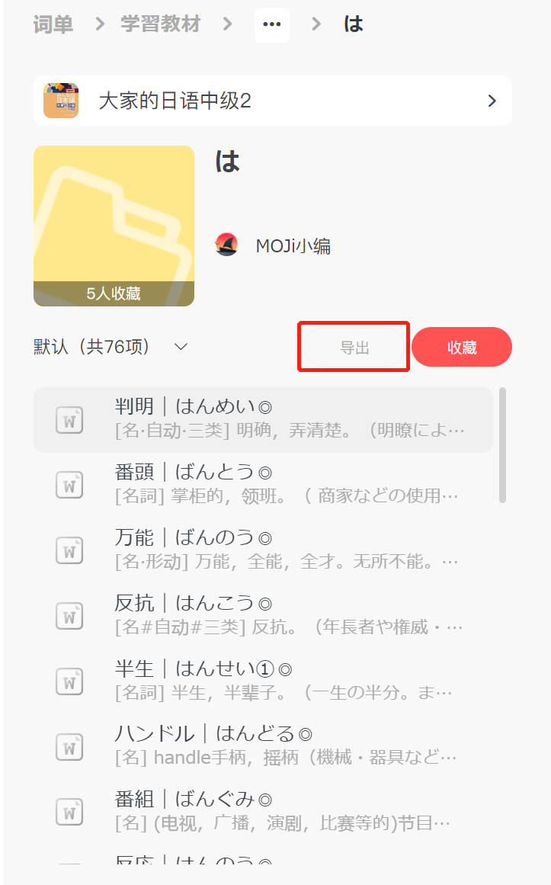

# Mojidict to Quizlet

An easy script converts word list from [MojiDict](https://www.mojidict.com/) to [Quizlet](https://quizlet.com/) wordcards.

## Requirements
- Python3
- Packages:

    ```bash
    $ pip install pdfplumber
    $ pip install pyperclip
    ```

## How to use
1. Find the required word list in [MojiDict 词单](https://www.mojidict.com/share-center), and select "导出"(output) to obtain the PDF file.

    For example, click "导出" at the word list page: 
    
    

    And you will get a PDF file with a random name. (that is `uQvGO4LfSr#KX815uZ3jg#0.pdf` in the demo)

2. Run the script using command window, and run the script.

    ```bash
    python .\convert.py
    ```

    And drag in the previous PDF file.

    > you may enter `y` to reverse the list if needed.

    ```
    PS C:\Users\ihkkn\Desktop> python C:\Users\ihkkn\Desktop\convert.py
    Enter your pdf path: C:\Users\ihkkn\Desktop\uQvGO4LfSr#KX815uZ3jg#0.pdf
    Wordlist Count: 76
    
    Reverse list? (y/n) (n for default): y


    刃（やいば）|（名詞）刀，剑。刃具。刃。形容极锋利、极有威力的样子。
    入る（はいる）|（五段活用）进，入，进入。在内，归入，有，含有。包括在其范围内。
    配属（はいぞく）|（名詞・サ行変格活用）分配，配属。也是他动词。分配，配
    配偶者（はいぐうしゃ）|（名）配偶，夫或妻。
    破壊（はかい）|（名·自他·三类）破坏。
    入り直す（はいりなおす）|（動詞）重新上學
    廃品（はいひん）|（名）废品。
    入り込む（はいりこむ）|（自動詞）进入，钻入，爬入。进到里面去，进到深处。同：這入りこむ
    ハウス（はうす）|（名）house家，房屋，住宅，建物。
    ...
    ```

3. Copy the output.

4. Create a new Study Set in Quizlet, enter the title you preferred and click "+Import".

    

5. Paste in all the outputs from the script (copy will be done automatically), and enter `|` for "Between term and definition".

    

6. Double check the results and click "Import".